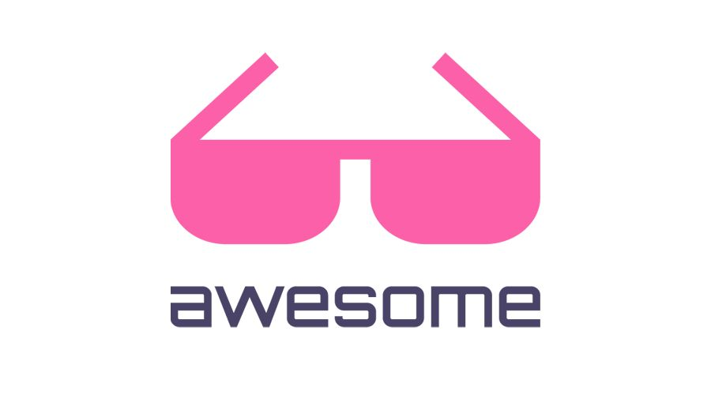

   
  
   
   

## By AR Portal（AR开发者社区）
#### AR开发者群：605785368
#### AR开发交流：891555732
#### 微信公众号：AR开发者社区

***
# AR platform
### [ARKit](https://developer.apple.com/arkit/)---ARKit是苹果在2017年WWDC推出的AR开发平台。开发人员可以使用这套工具iPhone和iPad创建增强现实应用程序
### [ARCore](https://developers.google.cn/ar/)---ARCore是谷歌推出的搭建增强现实应用程序的软件平台
### [Microsoft Hololens](https://www.microsoft.com/en-us/hololens/developers)---Microsoft HoloLens 是微软首个不受线缆限制的全息计算机设备，能让用户与数字内容交互，并与周围真实环境中的全息影像互动
### [Magic Leap](https://www.magicleap.com/)
### [Vuforia](https://www.ptc.com/en/products/augmented-reality)
### [Leap Motion](https://www.leapmotion.com/)---Reach into the future of virtual and augmented reality
### [Mapbox](https://www.mapbox.com/)---Mapbox是移动和web应用程序的位置数据平台。提供构建块来添加位置特性，如地图、搜索和导航到您创建的任何体验中。
### [Snapchat](https://lensstudio.snapchat.com/)---Snapchat 的野心：构建以 AR 为基础的计算平台
### [视+AR](http://www.sightp.com/)---领先的AR基础设施服务平台。视辰信息旗下拥有:视+AR编辑器,视+AR浏览器,EasyAR,视+教育等多种AR行业解决方案
### [百度AR](https://ar.baidu.com/home)---百度AR出自AR Lab(百度增强现实实验室),依托于百度大脑,旨在打造最智能交互的AR平台,提供AR技术、产品、服务一站式解决方案
### [腾讯AR](https://tar.qq.com/)---TAR 为腾讯智能平台团队自主研发,支持图像识别、人脸识别、虚拟动效渲染的 AR 开发引擎
### [QQ-AR](https://ar.qq.com/#/)---QQ-AR开放平台,助你轻松实现AR创意
### [阿里巴巴AR平台](https://open-ar.bot.tmall.com/)---全面开放阿里巴巴 AR 识别追踪、内容制作平台、高质量渲染引擎等核心能力,打通开发、上传到应用落地整套服务场景,助力业界共享智联网时代
### [网易AR](https://ar.163.com/)---网易AR是国内互联网巨头中规划最早、架构最完整的AR平台。凭借深厚的底层技术积累与强大的内容生态,并依托网易丰富的业态,在多个行业和场景拥有成熟的应用案例
### [京东AR](http://ar.jd.com/)---京东天工AR开放平台,旨在打造国内ARVR在消费领域最具影响力的平台,提供AR技术、产品、服务一站式解决方案
### [亮风台](https://www.hiscene.com/)---亮风台AR公司是一家全球领先的增强现实(AR)产品与服务提供商。拥有自主研发的计算机视觉、智能交互、人工智能及工业应用核心技术
### [6D.ai](https://www.6d.ai/)---6D是一个面向开发者的AR平台。使用6D现实平台生成的3D网格，开发人员可以构建世界级的应用程序，其中的资源是持久的，对遮挡做出响应，并在多个用户之间更有效地同步
### [8th Wall](https://www.8thwall.com/)---Breaking the wall between the digital and physical.
### [placenote](https://placenote.com/)---Placenote允许用户构建持久的AR应用程序，在任何物理空间中保存和共享AR内容
### [Wikitude](https://www.wikitude.com/)
### [visionLib](https://visionlib.com/)---VisionLib是一个面向企业增强现实应用程序的多平台库。
### [Kudan](https://www.kudan.io/)
### [Onirix](https://www.onirix.com/)---onrix是一个增强的现实平台，它允许创意人员和开发人员在移动应用程序上创建和发布自己的AR内容
### [MaxST](http://maxst.com/#/en)
### [Crunchfish](https://www.crunchfish.com/)---提供AR手势交互方案
***

# ARKit 教程

### 【SDK】  

#### [SDK 下载]()
### 【API文档】
#### [ARKit API](https://developer.apple.com/documentation/arkit#topics)

### 【SDK 功能特性】
#### [ARKit 2.0 - What's New - WWDC 2018](https://www.youtube.com/watch?v=WoSgwcZa4TE)

### 【视频教程】
#### [ARKit 2.0入门到精通-基础内容](http://edu.manew.com/course/681/tasks)
#### [ARKit 1.5入门到精通-基础内容](http://edu.manew.com/course/671/tasks)
#### [ARKit 1.0入门到精通-基础内容](http://edu.manew.com/my/course/636)
#### [ARKit 1.0入门到精通-实战案例 AR打地鼠](http://edu.manew.com/course/650)
#### [ARKit小案例开发-AR僵尸](http://edu.manew.com/course/685/tasks)
#### [ARKit小案例开发-AR生小人](http://edu.manew.com/course/684)
#### [ARKit小案例开发-AR卡通秀](http://edu.manew.com/course/674/tasks)
#### [ARKit小案例开发-AR唱片](http://edu.manew.com/course/676)
#### [ARKit小案例开发-AR魔法屋](http://edu.manew.com/course/682/tasks)
#### [ARKit小案例开发-Flying Dragon Part 1](https://www.youtube.com/watch?v=h59i7o2UCSg)
#### [ARKit小案例开发-Flying Dragon Part 2](https://www.youtube.com/watch?v=Q-AtBqFJXjA)
#### [ARkit实战开发视频教程](https://edu.51cto.com/course/10845.html)
#### [ARKit 专题教程 (Brian Advent)](https://www.youtube.com/watch?v=R8U8rGdMop4&list=PLY1P2_piiWEZFWsH507mBa5WGR7t6P4c_)
#### [Apple ARKit Tutorial: How to Build Tilt Brush Paint Demo in Unity](https://www.youtube.com/watch?v=Kj8mWHkBTTw&t=47s)
#### [Apple ARKit Tutorial:How To Make Augmented Reality Pets](https://www.youtube.com/watch?v=dp_Hj5HkFj0&t=793s)
#### [ARKit Tutorials 专题汇总](https://www.youtube.com/watch?v=smlBwvHdNlo&list=PL2hmCdxlIIutAjPlBiBL5PBNvqBlFqpq8)
#### [ARKit 实战开发-Portal任意门效果](https://www.youtube.com/watch?v=Z5AmqMuNi08&t=36s)
#### [ARKit教程:图片检测与3D跟踪](https://www.youtube.com/watch?v=ySYFZwkZoio&t=37s)
#### [ARKit Tutorial: The Complete ARKit Developer Course for iOS 11](https://www.youtube.com/watch?v=f3xFpRWZEz8)
#### [ARKit - Tutorial in how to create a virtual Globe using ARKit and SceneKit](https://www.youtube.com/watch?v=EmH2A4aFXZY&t=559s)
#### [ARKit 1.5 & Unity Tutorial - Vertical Plane detection](https://www.youtube.com/watch?v=vqtEHOYX2vw)
#### [ARKit 1.5 & Unity tutorial : Image Detection](https://www.youtube.com/watch?v=smlBwvHdNlo&t=82s)
#### [ARKit 2.0 & Unity tutorial: Object detection](https://www.youtube.com/watch?v=5uyqOX3nSyI)
#### [ARKit 2.0 & Unity tutorial: Image Tracking](https://www.youtube.com/watch?v=POIYPIJtgtM)
#### [ARKit 游戏教程-shooting game](https://www.youtube.com/watch?v=T2_k5NlPjtE)
#### [ARKit实战教程-Share Augmented Reality experiences on web, email & message](https://www.youtube.com/watch?v=uIyr_HZn7t0)
#### [ARKit DEV101](https://mobile-ar.reality.news/collection/apple-arkit/)

### 【图文教程】
#### [ARKit Tutorial: Understanding and Implementing 3D Objects](https://www.appcoda.com/arkit-3d-object/)
#### [ARKit Tutorial: Detecting Horizontal Planes and Adding 3D Objects with SceneKit](https://www.appcoda.com/arkit-horizontal-plane/)
#### [ARKit Tutorial: Light Estimation with Ambient Intensity and Color Temperature](https://www.appcoda.com/arkit-light-estimation/)
#### [ARKit Tutorial: Understanding Physics by Launching a Rocketship](https://www.appcoda.com/arkit-physics-scenekit/)
#### [ARKit 2.0 Tutorial: Saving and Restoring World-mapping Data to Create a Persistence AR Experience](https://www.appcoda.com/arkit-persistence/)
#### [ARKit Tutorial: Working with 2D Image Recognition](https://www.appcoda.com/arkit-image-recognition/)
#### [Recording ARKit Videos & Animated GIFs Using ARVideoKit](https://www.appcoda.com/record-arkit-video/)
#### [Creating an Interactive Dominoes Game Using ARKit and Swift](https://www.appcoda.com/interactive-arkit/)
#### [Realistic Rendering of 3D Photogrammetry Model in ARKit](https://www.appcoda.com/arkit-realism/)
#### [An Introduction to AR Quick Look in iOS 12](https://www.appcoda.com/arkit-quick-look/)
#### [iOS ARKit Tutorial – Augmented Reality iOS App](https://www.journaldev.com/21584/ios-arkit-tutorial-augmented-reality-app)
#### [iOS ARKit Tutorial: Drawing in the Air with Bare Fingers](https://www.toptal.com/swift/ios-arkit-tutorial-drawing-in-air-with-fingers)
#### [Building an AR app with ARKit and Scenekit](https://blog.pusher.com/building-an-ar-app-with-arkit-and-scenekit/)
#### [BUILD A REALTIME MEASURING APP WITH ARKIT](https://pusher.com/tutorials/realtime-measuring-arkit)
#### [BUILD A REALTIME GEOLOCATION APP WITH ARKIT AND CORELOCATION](https://pusher.com/tutorials/realtime-geolocation-arkit-corelocation)
#### [How to Make an Augmented Reality Mobile App for iOS 11](https://rubygarage.org/blog/create-augmented-reality-app-for-ios-11)
#### [Code Your First Augmented Reality App With ARKit](https://code.tutsplus.com/tutorials/code-your-first-augmented-reality-app-with-arkit--cms-29705)
#### [Using the Unity ARKit Plugin to Create Apps for the iPhone & iPad](https://mobile-ar.reality.news/how-to/arkit-101-using-unity-arkit-plugin-create-apps-for-iphone-ipad-0178022/)
#### [How to get started with augmented reality in Swift, the easy way](https://medium.freecodecamp.org/how-to-get-started-with-ar-in-swift-the-easy-way-7399fe1c82f5)
#### [Using ARKit on iOS to Build and Augmented Reality Shooter Game](https://heartbeat.fritz.ai/building-an-augmented-reality-shooter-game-with-arkit-on-ios-f75f947ecdb3)

### 【实例项目源码】
#### [Awesome-ARKit](https://github.com/olucurious/Awesome-ARKit)---ARKit 实例项目资源大汇总
#### [SwiftShot](https://developer.apple.com/documentation/arkit/swiftshot_creating_a_game_for_augmented_reality)---SwiftShot是一款针对两到六名玩家的AR游戏.
#### [ARKit-CoreLocation](https://github.com/ProjectDent/ARKit-CoreLocation)---精简版AR导航
#### [ARKit-Sampler](https://github.com/shu223/ARKit-Sampler)
#### [ARuler](https://github.com/duzexu/ARuler)---Mesure distance using apple ARKit
#### [CoreML-in-ARKit](https://github.com/hanleyweng/CoreML-in-ARKit)---检测物体并使用AR渲染显示3D标签
#### [FaceRecognition-in-ARKit](https://github.com/NovatecConsulting/FaceRecognition-in-ARKit)---使用Vision-API检测人脸，并通过coreml模型运行提取的人脸来识别特定的人。
#### [ARVideoKit](https://github.com/AFathi/ARVideoKit)---Capture & record ARKit videos 📹, photos 🌄, Live Photos 🎇, and GIFs 🎆.
#### [ARShooter](https://github.com/farice/ARShooter)---AR射击小游戏
#### [ARBrush](https://github.com/laanlabs/ARBrush)---AR画刷
#### [Findme](https://github.com/mmoaay/Findme)---An ARKit App that can help your friends to find you.
#### [arkit-tictactoe](https://github.com/bjarnel/arkit-tictactoe)---Tic-Tac-Toe implemented using ARKit+Scenekit.
#### [ARSolarPlay](https://github.com/miliPolo/ARSolarPlay)---AR太阳系动画.
#### [ARBottleJump](https://github.com/songkuixi/ARBottleJump)---AR版微信跳一跳.
#### [ARGitHubCommits](https://github.com/songkuixi/ARGitHubCommits)---AR版GitHub图表.
#### [ARKit-Emperor](https://github.com/kboy-silvergym/ARKit-Emperor)---Power! Unlimited power for ARKit 2.0!
***

# ARCore 教程

### 【SDK】
#### [ARCore](https://developers.google.com/ar/develop/downloads?hl=zh-cn)

### 【API文档】
#### [ARCore API](https://developers.google.com/ar/reference/?hl=zh-cn)

### 【SDK 功能特性】
#### [ARCore features](https://v.qq.com/x/page/z05440pm9to.html)

### 【视频教程】
#### [Unity ARCore Tutorial : How To Build Shooting Stars](https://www.youtube.com/watch?v=bJDEAQADi0U)
#### [Hands-On ARCore Development专题教程](https://www.youtube.com/watch?v=XVXqatV9eKg&list=PLTgRMOcmRb3OOCZBJ7_XZRcky8TgIqfDZ&index=1)
#### [ARCore小实例教程-Portal任意门效果](https://www.youtube.com/watch?v=BeoY5mRm1UY)
#### [Building your first ARCore app in Unity公开课](https://www.youtube.com/watch?v=GkzMFNmvums)
#### [ARCore 任意门效果实战教程 - Part1](https://www.youtube.com/watch?v=g78hQB8UKEM)
#### [ARCore 任意门效果实战教程 - Part 2](https://www.youtube.com/watch?v=_wsBWNRop4I)
#### [ARCore 任意门效果实战教程 - Part 3](https://www.youtube.com/watch?v=pWHbD4eXCng)
#### [ARCore 任意门效果实战教程 - Part 4](https://www.youtube.com/watch?v=OBb4iUiXaRA)
#### [AR Portal Tutorial with Unity - 360 Video](https://www.youtube.com/watch?v=ec6WgO5C8CA)
#### [How To Unity ARCore系列教程](https://www.youtube.com/watch?v=EpH4q1YNUBk&list=PLKIKuXdn4ZMjuUAtdQfK1vwTZPQn_rgSv)
#### [Build AR apps in Android Studio using Sceneform SDK (ARCore)系列教程](https://www.youtube.com/watch?v=hj7PpoEHv74&list=PLsOU6EOcj51cEDYpCLK_bzo4qtjOwDWfW&index=1)

### 【图文教程】
#### [ARCore Sceneform SDK: Getting Started](https://www.raywenderlich.com/5485-arcore-sceneform-sdk-getting-started)
#### [ARCore 101: Quick guide to Google’s Augmented Reality platform](https://haptic.al/arcore-101-fa6f93d4c003)
#### [Android Augmented Reality – Android ARCore Example](https://www.journaldev.com/21479/android-augmented-reality-arcore-example)
#### [Build an ARCore app with Unity from scratch](https://hub.packtpub.com/unity-arcore-application-android/)
#### [Creating an AR Football Game using Nuitrack and ARCore](http://download.3divi.com/Nuitrack/doc/UnityARCore_page.html)
#### [Getting Started with ARCore development using Java and ViroCore](https://blog.viromedia.com/getting-started-arcore-development-java-virocore-ar-android-ebbb36aa6ca3)
#### [ARCore by Google: Building Augmented Images Application](https://ayusch.com/arcore-building-augmented-images-application/)
#### [Build an augmented reality Android app with Google ARCore](https://www.androidauthority.com/google-arcore-972579/)

### 【实例项目源码】
#### [arcore-android-sdk](https://github.com/google-ar/arcore-android-sdk)---ARCore SDK for Android Studio
#### [arcore-unity-sdk](https://github.com/google-ar/arcore-unity-sdk)---ARCore SDK for Unity 
#### [ARCore SDK for Unreal](https://github.com/google-ar/arcore-unreal-sdk)---ARCore SDK for Unreal
#### [norman-ar](https://github.com/googlecreativelab/norman-ar)---Decorate your world with AR animations.
#### [justaline-android](https://github.com/googlecreativelab/justaline-android)---The first cross-platform collaborative AR app (for doodling).
#### [ar-drawing-java](https://github.com/googlecreativelab/ar-drawing-java)---A simple AR drawing experiment build in Java using ARCore.
#### [arexperiments-portal-painter](https://github.com/googlecreativelab/arexperiments-portal-painter)---Doodle new worlds onto your own, with Google ARCore.
#### [Flight-Paths](https://github.com/wdlindmeier/Flight-Paths)---Augmented Reality Flight Paths Visualizer.

***

# Hololens 教程

### 【SDK】
#### [Install the tools](https://docs.microsoft.com/en-us/windows/mixed-reality/install-the-tools)
### 【API文档】
#### [Develop](https://docs.microsoft.com/en-us/windows/mixed-reality/development)
#### [Design](https://docs.microsoft.com/en-us/windows/mixed-reality/design)

### 【SDK 功能特性】
#### [Microsoft HoloLens: Development Overview](https://www.youtube.com/watch?v=A784OdX8xzI)

### 【视频教程】
#### [Hololens MR 技术分享](http://edu.manew.com/my/course/204)
#### [Hololens全息房产项目](http://edu.manew.com/course/350)
#### [Hololens开发入门篇](https://edu.csdn.net/course/detail/6639/130699)
#### [Start Developing HoloLens Apps Today 开始开发HoloLens应用吧](https://www.taikr.com/course/378/tasks)
#### [Hololens Tutorial 专题](https://www.youtube.com/watch?v=OYx4qIqi0oI&list=PLEjp5Cbksqk4K-TVJcZyZ-GhGpuY3mPgD)
#### [AR Image Recognition with Hololens and Vuforia](https://www.youtube.com/watch?v=u6fT2zaEKVc)
#### [Hololens Tutorial - Change material on Gaze (Unity3D / Holotoolkit)](https://www.youtube.com/watch?v=accohRU5qUU)
#### [Hololens Tutorial Series](https://www.youtube.com/watch?v=CidU-SEvE8g&list=PLEjp5Cbksqk5vZIR9_1Qdegxfh3gaZZaQ)
#### [Building AR for Hololens (NO HEADSET REQUIRED!)](https://www.youtube.com/watch?v=FOkbfOJEDDk&t=46s)
#### [Tutorial Hololens Development Pt 2: Basic App & Deployment](https://www.youtube.com/watch?v=907BGdJxJuw)
#### [HoloLens Tutorial Simple Projectile](https://www.youtube.com/watch?v=58612RT2CT8)
#### [Tutorial Hololens Unity](https://www.youtube.com/watch?v=AYvEghcto5g)

### 【图文教程】
#### [INSTALLING THE HOLOLENS SDK](https://pterneas.com/2016/04/04/installing-hololens-sdk/)
#### [GETTING STARTED WITH HOLOLENS AND UNITY3D](https://pterneas.com/2016/04/04/getting-started-hololens-unity3d/)
#### [A POKEMON-GO CLONE FOR HOLOLENS](https://pterneas.com/2016/10/30/pokemon-go-clone-hololens/)
#### [AZURE + HOLOLENS = MIXED REALITY TO THE CLOUD!](https://pterneas.com/2019/02/24/azure-hololens-mixed-reality-to-the-cloud/)
#### [How to Set Up Your HoloLens in Developer Mode for Unity and Build AR Apps](https://circuitstream.com/hololens-unity-setup/)
#### [HoloLens Development Tutorial](https://www.buildwagon.com/guide.html)
#### [MRTK: Open-Source Building Blocks for Windows Mixed Reality Experiences](https://medium.com/@dongyoonpark/open-source-building-blocks-for-windows-mixed-reality-experiences-hololens-mixedrealitytoolkit-28a0a16ebb61)
#### [Getting Started with Microsoft HoloLens Development](https://www.sitepoint.com/getting-started-with-microsoft-hololens-development/)

### 【实例项目源码】

#### [MixedRealityToolkit-Unity](https://github.com/Microsoft/MixedRealityToolkit-Unity)---MixedRealityToolkit-Unity uses code from the base MixedRealityToolkit repository and makes it easier to consume in Unity.
#### [HoloLensWithOpenCVForUnityExample](https://github.com/EnoxSoftware/HoloLensWithOpenCVForUnityExample)---HoloLens With OpenCVforUnity Example.
#### [MRDesignLabs_Unity_PeriodicTable](https://github.com/Microsoft/MRDesignLabs_Unity_PeriodicTable)---Periodic Table of the Elements for HoloLens and Immersive headset.
#### [LiveScan3D-Hololens](https://github.com/MarekKowalski/LiveScan3D-Hololens)---A Unity application for receiving and rendering point clouds on Hololens and other devices.
#### [HoloLensARToolKit](https://github.com/qian256/HoloLensARToolKit)---Marker tracking using the front-facing camera of HoloLens and Unity3D, with a wrapper of ARToolKit built for UWP (Windows Universal Platform).
#### [hololens_facial_recognition](https://github.com/UoA-eResearch/hololens_facial_recognition)---A Unity hololens app to detect faces and display their attributes.
#### [HoloBot](https://github.com/ActiveNick/HoloBot)---HoloBot is a reusable 3D interface that allows HoloLens & VR users to interact with any bot using Mixed Reality & Speech.
#### [MRLightingTools-Unity](https://github.com/Microsoft/MRLightingTools-Unity)---A Unity library and MRTK extension for estimating and replicating the current environment's lighting on Mixed Reality devices.

***

# Vuforia 教程

### 【SDK】
#### [Vuforia Engine](https://developer.vuforia.com/downloads/sdk)

### 【API文档】

#### [Vuforia API](https://developer.vuforia.com/support)

### 【视频教程】
#### [AR系列教程 - Vuforia入门](http://www.sikiedu.com/course/133/tasks)
#### [AR系列教程 - Vuforia进阶](http://www.sikiedu.com/course/149/tasks)
#### [AR涂涂乐 （Vuforia） - 实战讲解](http://edu.manew.com/course/162)
#### [Vuforia精选专题教程1](https://www.youtube.com/watch?v=XoyGP-1pXko&list=PLAB1AiCfff7foWIgYsXK3iI6bYHbfnVOs)
#### [Vuforia精选专题教程2](https://www.youtube.com/watch?v=zpiFZtPxo2w&list=PLb1h4A0yB97_TeFuf9TAEah3b-VyIYzF9)
#### [Vuforia精选专题教程3](https://www.youtube.com/channel/UCBVWZH7ZrnegbWiK9pY5V-A/search?query=tutorial)
#### [Creating AR Content with Vuforia](https://www.youtube.com/watch?v=9XikHnTiukk&list=PLX2vGYjWbI0Thl0pOCbKWrbbiw7RWiRG7&index=1)
#### [Augmented Reality Tutorial: Vuforia 7 Ground Plane Detection SLAM](https://www.youtube.com/watch?v=0O6VxnNRFyg)
#### [How to create an Augmented Reality App](https://www.youtube.com/watch?v=MtiUx_szKbI)
#### [Using Vuforia For HoloLens Static Room Calibration In Unity (Tutorial)](https://www.youtube.com/watch?v=W7z2sggDGoo)
#### [Vuforia Unity Android Tutorial, Your First AR App in 20 minutes](https://www.youtube.com/watch?v=HnjbTytHH6U)
#### [Unity 3D AR - Unity Vuforia Augmented Reality Tutorial](https://www.youtube.com/watch?v=SoQuUW-oL3k)
#### [How To Make Simple Augmented Reality App With Unity 2018 And Vuforia 8.0](https://www.youtube.com/watch?v=t-EhE0yXDAg)
#### [Text Recognition Tutorial In Vuforia and Unity 3D](https://www.youtube.com/watch?v=ysT8lXSfxZ0)
#### [Implementing anAugmented Reality Virtual Buttons in Vuforia Tutorial](https://www.youtube.com/watch?v=014n6HnJl6Q)
#### [Vuforia 7 - 3D Object Scanner Tutorial in Unity 2017](https://www.youtube.com/watch?v=KfiAQbp_QN8)
#### [Virtual Buttons Tutorial: Unity + Vuforia](https://www.youtube.com/watch?v=4EcrDnbaGgE)

***

# EasyAR 教程

### 【SDK】
#### [EasyAR SDK](https://www.easyar.cn/view/download.html)

### 【API文档】
#### [EasyAR SDK](https://www.easyar.cn/doc/EasyAR%20SDK/EasyAR%20SDK.html)
#### [EasyAR CRS](https://www.easyar.cn/doc/EasyAR%20CRS/EasyAR%20CRS.html)
#### [EasyAR WebAR](https://www.easyar.cn/doc/EasyAR%20WebAR/)

### 【SDK 功能特性】
#### [EasyAR SDK](https://www.bilibili.com/video/av8438770?from=search&seid=7983987206322374767)

### 【视频教程】
#### [0基础带你玩转AR项目](https://www.taikr.com/course/855/tasks)
#### [国产AR引擎 EasyAR的使用流程演示 小意思VR](https://www.bilibili.com/video/av32877164?from=search&seid=16421291367455015052)
#### [AR互动大屏项目实战课程](http://edu.manew.com/course/216/tasks)
#### [EasyAR官方示例实际效果演示](https://www.bilibili.com/video/av24193142/?p=1)

### 【图文教程】
#### [EasyAR 初学者入门指南（1）---显示模型](http://forum.easyar.cn/portal.php?mod=view&aid=2)
#### [EasyAR 初学者入门指南 (2）---多图识别](http://forum.easyar.cn/portal.php?mod=view&aid=3)
#### [EasyAR 初学者入门指南（3）---二维码+AR的应用（上）](http://forum.easyar.cn/portal.php?mod=view&aid=7)
#### [EasyAR 初学者入门指南（3）---二维码+AR的应用（下）](http://forum.easyar.cn/portal.php?mod=view&aid=8)
#### [EasyAR 初学者入门指南（4）---录屏功能](http://forum.easyar.cn/portal.php?mod=view&aid=15)
#### [EasyAR 初学者入门指南（5）---显示视频](http://forum.easyar.cn/portal.php?mod=view&aid=20)
#### [EasyAR 初学者入门指南（6）---创建ImageTarget的不同方式](http://forum.easyar.cn/portal.php?mod=view&aid=21)
#### [EasyAR 初学者入门指南（7）---3D物体识别与跟踪](http://forum.easyar.cn/portal.php?mod=view&aid=22)
#### [EasyAR + 第三方插件开发系列（1）--模型控制](http://forum.easyar.cn/portal.php?mod=view&aid=12)
#### [EasyAR + 第三方插件开发系列（2）--伤害效果](http://forum.easyar.cn/portal.php?mod=view&aid=13)
#### [EasyAR多图识别简单案例---双卡battle1.0](http://forum.easyar.cn/portal.php?mod=view&aid=4)
#### [EasyAR交互操作实例---玩转僵尸](http://forum.easyar.cn/portal.php?mod=view&aid=6)
#### [EasyAR 开发实例---AR红包（初级）](http://forum.easyar.cn/portal.php?mod=view&aid=10)
#### [EasyAR 开发实例---AR礼物（适合初学者）](http://forum.easyar.cn/portal.php?mod=view&aid=11)
#### [EasyAR 开发实例—Pokemon Go（1）](http://forum.easyar.cn/portal.php?mod=view&aid=14)
#### [EasyAR+Leap Motion 开发创意 AR 应用](http://forum.easyar.cn/portal.php?mod=view&aid=16)
#### [EasyAR 开发技巧----截屏](http://forum.easyar.cn/portal.php?mod=view&aid=17)
#### [EasyAR 开发技巧 ----- 关于 tracker](http://forum.easyar.cn/portal.php?mod=view&aid=26)
#### [EasyAR开发技巧---模型交互操作](http://forum.easyar.cn/portal.php?mod=view&aid=5)
#### [Web新手之使用EasyAR实现WebAR](https://blog.csdn.net/dengshunhao/article/details/80424443)

***
# Magic Leap 教程

### 【SDK】

#### [LuminSDK](https://creator.magicleap.com/home)

### 【API】
#### [API](https://creator.magicleap.com/learn/reference)
#### [Guides](https://creator.magicleap.com/learn/guides)
#### [Tutorials](https://creator.magicleap.com/learn/tutorials)

### 【视频教程】

#### [Magic Leap开发教程专题](https://www.youtube.com/watch?v=2u_fJx65G8Y&list=PLQMQNmwN3Fvzkz4Ce9C92jzG1mwvYjvyh&index=1)
#### [Magic Leap With Unity3d tutorial #1: Create Dancing Character Simulation in Magic leap](https://www.youtube.com/watch?v=_SwCoMdGh2A&t=146s)
#### [Magic Leap With Unity3D tutorial #2- Creating Modified rooms with Virtual Room Generator](https://www.youtube.com/watch?v=SbmCkbswHVA)
#### [Magic Leap With Unity3D tutorial #3 - Gesture Controls in Magic Leap](https://www.youtube.com/watch?v=pBCNf5HE0Dg)
#### [Magic Leap with Unity3D tutorial #4 - Controlling Animations from Gestures](https://www.youtube.com/watch?v=nBF7VSTfrEs)
#### [Magic Leap With Unity3D tutorial #5 - Collision detection in virtual room (Shooting balls)](https://www.youtube.com/watch?v=zhuK68dBCvk)
#### [Unity Tutorial: Get Started with Magic Leap and Image Recognition!](https://www.youtube.com/watch?v=1UULB-Fo-ec&t=82s)
#### [Magic Leap + Unity Tutorial: 01 Getting Ready](https://www.youtube.com/watch?v=6IeRpRakre4&t=18s)
#### [Magic Leap + Unity - Tutorial 02: First Project](https://www.youtube.com/watch?v=TZNJXhq1VHw)
#### [Magic Leap + Unity - Tutorial 03: First Script](https://www.youtube.com/watch?v=jkvrNJLaJ9I)
#### [Magic Leap Creators - Building Unity3d project with zero iteration and creating virtual rooms](https://www.youtube.com/watch?v=ZEgErrxy-rk&t=2s)

### 【图文教程】
#### [A Developer’s Guide to Getting Started with Magic Leap and Unity](https://www.pubnub.com/blog/getting-started-with-magic-leap-and-unity-developer-tutorial/)
#### [1.Get Started with Magic Leap Remote](https://creator.magicleap.com/learn/tutorials/tutorial-getting-started-with-magic-leap-remote)
#### [2.Interacting with Head Locked Content Unity Edition](https://creator.magicleap.com/learn/tutorials/interacting-with-head-locked-content-unity-r-version)
#### [3.Eye Tracking in Lumin Runtime](https://creator.magicleap.com/learn/tutorials/eye-tracking-lumin-runtime)
#### [4.Hand Tracking in Lumin Runtime](https://creator.magicleap.com/learn/tutorials/hand-tracking-in-lumin-runtime)
#### [5.Control 6 DOF - Lumin Runtime Edition](https://creator.magicleap.com/learn/tutorials/control-6-dof-lumin-runtime-edition)
#### [6.Application File System - Lumin Runtime Edition](https://creator.magicleap.com/learn/tutorials/application-file-system-lumin-runtime)
#### [7.Interacting with the Control - Lumin Runtime Edition](https://creator.magicleap.com/learn/tutorials/control-lumin-runtime)
#### [8.6 DOF - Unity Edition](https://creator.magicleap.com/learn/tutorials/6dof-unity-r-edition)
#### [9.Creating a Custom Vignette, Unity Edition](https://creator.magicleap.com/learn/tutorials/creating-a-custom-vignette-unity-r-edition)
#### [10.Introduction to Meshing - Unity Edition](https://creator.magicleap.com/learn/tutorials/introduction-to-meshing-unity-r-edition)
#### [11.Content Persistence in Unity: Locally Stored Content](https://creator.magicleap.com/learn/tutorials/persistence-unity-locally-stored-content)
#### [12.Touchpad Gestures - Unity Edition](https://creator.magicleap.com/learn/tutorials/touchpad-gestures-unity-edition)
#### [13.Eye Tracking - Unity Edition](https://creator.magicleap.com/learn/tutorials/eye-gaze-unity)
#### [14.Touchpad Gestures - Unreal Engine Edition](https://creator.magicleap.com/learn/tutorials/touchpad-gestures-unreal-engine-edition)
#### [15.Hello, Prismatic!](https://creator.magicleap.com/learn/tutorials/hello-prismatic)
#### [16.Simulating Input - Magic Leap Remote](https://creator.magicleap.com/learn/tutorials/simulating-input-on-magic-leap-remote)
#### [17.Interacting with Head Locked Content Unreal Engine 4 Edition](https://creator.magicleap.com/learn/tutorials/interacting-with-head-locked-content-unreal-engine-edition)
#### [18.Introduction to Meshing - Unreal Engine 4 Edition](https://creator.magicleap.com/learn/tutorials/introduction-to-meshing-unreal-engine-4-edition)
#### [19.Magic Leap One Project Setup: Unreal Engine 4 Edition](https://creator.magicleap.com/learn/tutorials/magic-leap-one-project-setup-unreal-engine-4-edition)
#### [20.Hello, other Cube! - Casting your cube to other users](https://creator.magicleap.com/learn/tutorials/hello-other-cube-casting)
#### [21.6DOF - Unreal Engine Edition](https://creator.magicleap.com/learn/tutorials/6dof-unreal)
#### [22.Magic Leap Remote - Hello, Cube! Unreal Engine 4 Edition](https://creator.magicleap.com/learn/tutorials/tutorial-getting-started-with-unreal)
#### [23.Eye Gaze - Unreal Engine Edition](https://creator.magicleap.com/learn/tutorials/eye-gaze-unreal)
#### [24.Creating a Custom Vignette, Unreal Engine 4 Edition](https://creator.magicleap.com/learn/tutorials/creating-a-custom-vignette-unreal-engine-4-edition)

***

# 其他精选教程
#### [Leap Motion and Unity系列教程](https://www.youtube.com/watch?v=Wh3YK2OcI4M&list=PLnTTrMDXCsLpjeAYUXdgcpuGBWZSp7vyS&index=1)
#### [Leap Motion and Unreal系列教程](https://www.youtube.com/watch?v=fmtBQzD7ZFE&list=PLZgjuTxMC0h1ayYeTedOUL5fIOkxM8hj8)
#### [Leap Motion and Python系列教程](https://www.youtube.com/watch?v=T9k7rdY625M&list=PLgTGpidiW0iTELuljcIdTkA5SjHa5tudP)
#### [Leap Motion and Java系列教程](https://www.youtube.com/watch?v=oHsDkNLipWE&list=PLgTGpidiW0iQGk-zYzmcDw6XtEMYh69j4)
#### [8th Wall - Build an AR App](https://www.youtube.com/watch?v=NPI6hnHlNgs)
#### [8th Wall - How to Create an AR Portal for the Web](https://www.youtube.com/watch?v=mQQ8awe3Bqs)
#### [8th Wall - Augmented Reality App Development](https://www.youtube.com/watch?v=HU2XNR4aUwo)
#### [8th Wall - Roll-A-Ball Augmented Reality Tutorial](https://www.youtube.com/watch?v=gyOOf25321M)
#### [Kudan SLAM Similar Technique Used in Pokemon Go](https://www.youtube.com/watch?v=xuE34dP4FsI)
#### [Wikitude系列教程](https://www.youtube.com/watch?v=QKiHWAX0sKo&list=PL3839D3D62346FD1D)
#### [Wikitude Markerless AR SLAM](https://www.youtube.com/watch?v=YbFuaAxntUA&t=20s)
#### [Wikitude OBJECT TRACKING](https://www.youtube.com/watch?v=D_SWbt-lMvU)
#### [Wikitude Tutorial - Native SDK for Android](https://www.youtube.com/watch?v=uuNdrwKdHnE)
#### [Wikitude Tutorial - JavaScript SDK for Android](https://www.youtube.com/watch?v=ux4HbnUjNMc)
#### [Wikitude Tutorial - Android Unity Plugin](https://www.youtube.com/watch?v=iGySZp_fWHQ)
#### [Augmented Reality Tutorial Multiple Target Tracking with Wikitude](https://www.youtube.com/watch?v=vSlJSnx39zM&t=35s)
#### [ Augmented Reality Tutorial - SLAM Technology with Wikitude SDK6](https://www.youtube.com/watch?v=QaAFGtJw_uA)

# AR 网站
### [映维网](https://yivian.com/)---影响力虚拟现实(VR)、增强现实(AR)产业信息数据平台
### [青亭网](http://www.7tin.cn/)---链接科技前沿,服务商业创新
### [VR陀螺](http://vrtuoluo.cn/)---挖掘VR/AR行业机会,为创业者传递价值
### [87870](http://www.87870.com/)---AR·VR·MR产业价值聚合平台
### [Next Reality](https://next.reality.news/)
### [VRSCOUT](https://vrscout.com/)
### [VRFocus](https://www.vrfocus.com/)
### [AfterNow](https://www.afternow.io/)
### [ARinChina](http://www.arinchina.com/)－－增强现实中国ARinChina 是中国最大的专注于AR增强现实技术行业的门户网站。
### [AR 学院](http://www.arvrschool.com/)－－增强现实|虚拟现实技术交流社区、综合门户
### [AR 村](http://www.arcun.cn/)－－提供最新最快的AR增强现实信息,最权威的AR增强现实解读与产品发布.
### [柚子AR](http://www.youziar.com/)－－柚子AR打造专业的增强现实技术领域门户网站,提供AR资讯、AR技术、AR视频、AR游戏、AR设备等相关知识教程,柚子AR,打造增强现实行业交流聚集地。
### [ChinaAR](http://www.chinaar.com/)－－中国AR网,是国内第一家打造增强现实技术交流的一个自媒体平台!意在打造中国AR爱好者对AR技术的交流与学习的一个平台
### [AR 中国](http://www.archina.org/)－－AR中国是专注于增强现实技术的新闻门户网站
***

# AR 眼镜
### [Hololens](https://www.microsoft.com/en-us/hololens)---Microsoft HoloLens 是微软首个不受线缆限制的全息计算机设备，能让用户与数字内容交互，并与周围真实环境中的全息影像互动。
### [Magic Leap One](https://www.magicleap.com/)---Magic Leap One是Magic Leap推出的一款增强现实眼镜，支持语音、手势、头部移动和眼球控制多种方式
### [META](https://www.metavision.com/)
### [Project North Star](https://developer.leapmotion.com/northstar)
### [Vuzix](https://www.vuzix.com/)---Vuzix，是美国一家智能眼镜创业公司，推出了Blade、M300XL、M300三款AR眼镜
### [North Focals](https://www.bynorth.com/)---North（以前称为Thalmic Labs）推出旗下首款智能眼镜Focals。乍一看，Focals是一副普通的眼镜，有点类似于intel Vaunt， 数字界面设计为漂浮在右眼前方，Focals在右眼镜框架内集成了处理SoC和激光投影仪将信息发送到您视线中的小圆形贴片上
### [Snap Spectacles ](https://www.spectacles.com/)---Snap推出了新一代智能眼镜——Spectacles 2，这款智能眼镜能够拍摄照片、录制视频，并支持了防水功能，可以在较浅的水域中拍摄。
### [DreamWorld](https://www.dreamworldvision.com/)---DreamWorld是一款低成本、高科技、跨平台兼容、90度FOV、配合手机使用的光学透视增强现实眼镜
### [Everysight Raptor](https://everysight.com/)---Raptor 眼镜瞄准的群体是自行车骑行者，铁人三项等技术精湛的骑行人士。Raptor眼镜能提供高分辨率和半透明的信息，如心率、节奏、速度、力量、距离等，随着骑手的前进，这些信息始终保持在骑手眼前。 它具有内置的GPS导航功能，以及蓝牙连接功能，可随时随地查看手机通知。
### [ODG](osterhoutgroup.com)
### [影创科技](http://www.shadowcreator.com/)---影创科技是一家主要研发增强现实智能眼镜及眼镜操作系统、交互方法、内容的科技公司。主要产品是Halo Mini增强现实眼镜。
### [耐德佳AR眼镜](http://nedglass.com/)---中国AR光学解决方案的领军供应商
### [联想AR眼镜](https://lenovo-mr.com/)---联想主要推出了daystAR G1和daystAR G2两款AR眼镜
### [亮风台AR眼镜](https://www.hiscene.com/detail-glasses/)
### [灵犀微光](http://www.lx-ar.com/miniglass.php)---主要聚焦在AR光学显示技术研发，主攻AR产品中的核心器件光学引擎
### [悉见科技](http://xiijan.com/)---旗下AR眼镜产品主要有X1、XMAN、Momentos.
### [0glass](http://www.0glass.cn)---AR工业应用|工业级AR眼镜|0glass-AR工业解决方案领导者
### [枭龙科技](https://www.xloong.com/)---AR双目智能眼镜Techlens T2专为行业需求而设计，它的便携、易用、可靠的特点，可大幅提升工作效率，广泛应用于、仓储物流、制造装配、医疗护理、设备维修、设计规划等领域。
***

# AR Tools

### [Lens Studio](https://lensstudio.snapchat.com/)---Lens Studio是Snapchat推出的首款桌面应用程序，开发者、品牌方或是普通用户，都能在Mac或Windows桌面上创建交互式的虚拟3D形象，在照片或视频中感受AR体验。
### [Spark AR Studio](https://sparkar.facebook.com/ar-studio/)---Facebook推出的AR特效制作平台
### [Amazon Sumerian](https://aws.amazon.com/cn/sumerian/?sc_channel=PS&sc_campaign=acquisition_UK&sc_publisher=google&sc_medium=ACQ-P%7CPS-GO%7CNon-Brand%7CDesktop%7CSU%7CAR%20VR%7CSumerian%7CUK%7CEN%7CText&sc_content=AR_bmm&sc_detail=%2Bar&sc_category=AR%20VR&sc_segment=293650828921&sc_matchtype=b&sc_country=UK&s_kwcid=AL!4422!3!293650828921!b!!g!!%2Bar&ef_id=CjwKCAjwk7rmBRAaEiwAhDGhxCaE-XmJWSFcexhe9dW8V6JcxhXky3HPmiaLXkY7DRrHJmF-2OYDPBoC4UMQAvD_BwE:G:s)---Amazon Sumerian是亚马逊推出的帮助用户快速轻松地创建和运行虚拟现实 (VR)、增强现实 (AR) 和 3D 效果的应用程序，而无需掌握任何专门的编程或 3D 图形专业知识。

***
# 不断更新中...

